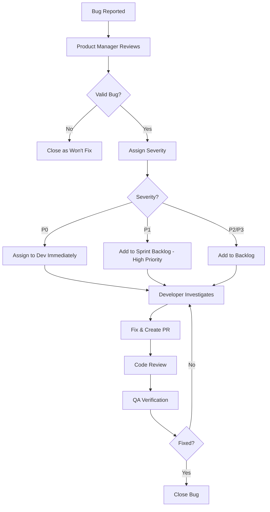

# Phase 3 Bug Fixes & Refinements Specification

**Work Stream:** 48
**Phase:** 3 - Advanced Features
**Dependency Level:** 2
**Created:** 2025-12-22
**Status:** Complete

## Overview

This specification defines the bug triage, fixing workflow, and quality refinements for Phase 3: Advanced Features. It covers the systematic process for addressing bugs identified during QA testing (Work Stream 47), performance optimizations, and UX refinements based on early user feedback.

### Objectives

- **Fix all P0 and P1 bugs** before Phase 3 launch
- **Optimize performance** for new advanced features
- **Refine user experience** based on testing feedback
- **Ensure code quality** through reviews and refactoring
- **Update documentation** to reflect all changes

---

## Bug Triage & Prioritization

### Severity Levels

| Severity | Definition | Response Time | Examples |
|----------|------------|---------------|----------|
| **P0 (Critical)** | Blocks core functionality, data loss, security vulnerability | Fix immediately | Conditional questions crash app, shareable links expose private data, CSV export corrupts data |
| **P1 (High)** | Major feature broken, poor UX, affects many users | Fix within 24h | Analytics dashboard doesn't load, activity log search returns wrong results, multi-phase report template missing sections |
| **P2 (Medium)** | Minor feature issue, workaround exists | Fix within 1 week | Conditional question UI glitch, chart tooltip missing, export button hard to find |
| **P3 (Low)** | Cosmetic issue, edge case, nice-to-have | Fix if time permits | Color inconsistency, typo in label, minor alignment issue |

### Triage Process



---

## Common Bug Categories & Fixes

### 1. Conditional Questions Issues

#### Bug Type: Circular Dependency Crashes

**Symptom:** App crashes when Q1 depends on Q2 and Q2 depends on Q1

**Root Cause:** No validation preventing circular dependencies

**Fix:**
```typescript
// File: src/services/conditionalQuestionService.ts

function validateConditionalRules(questionId: string, rules: ConditionalRule[]): void {
  const visited = new Set<string>();
  const recursionStack = new Set<string>();

  function detectCycle(qId: string): boolean {
    if (recursionStack.has(qId)) {
      return true; // Cycle detected
    }
    if (visited.has(qId)) {
      return false; // Already processed, no cycle
    }

    visited.add(qId);
    recursionStack.add(qId);

    // Get all questions that this question depends on
    const dependencies = rules
      .filter(r => r.question_id === qId)
      .map(r => r.target_question_id);

    for (const depId of dependencies) {
      if (detectCycle(depId)) {
        return true;
      }
    }

    recursionStack.delete(qId);
    return false;
  }

  if (detectCycle(questionId)) {
    throw new ValidationError(
      'Circular dependency detected. A question cannot depend on itself or create a dependency loop.'
    );
  }
}
```

#### Bug Type: Question Not Hiding When Condition Changes

**Symptom:** User changes answer, but dependent question doesn't disappear

**Root Cause:** Frontend not clearing response when question becomes hidden

**Fix:**
```typescript
// File: src/components/Questionnaire/QuestionnaireFlow.tsx

function handleAnswerChange(questionId: string, value: any) {
  setResponses(prev => ({
    ...prev,
    [questionId]: value
  }));

  // Re-evaluate all conditional questions
  const newVisibility = evaluateAllConditions(responses, questions);

  // Clear responses for questions that are now hidden
  const clearedResponses = { ...responses, [questionId]: value };
  Object.keys(clearedResponses).forEach(qId => {
    if (!newVisibility[qId]) {
      delete clearedResponses[qId];
    }
  });

  setResponses(clearedResponses);
  setQuestionVisibility(newVisibility);
}
```

#### Bug Type: Progress Calculation Incorrect

**Symptom:** Progress shows "10 of 8 questions complete"

**Root Cause:** Progress counts hidden questions

**Fix:**
```typescript
function calculateProgress(responses: Responses, visibility: Visibility): Progress {
  const visibleQuestions = Object.keys(visibility).filter(qId => visibility[qId]);
  const answeredQuestions = visibleQuestions.filter(qId => responses[qId] !== undefined);

  return {
    total: visibleQuestions.length,
    completed: answeredQuestions.length,
    percentage: Math.round((answeredQuestions.length / visibleQuestions.length) * 100)
  };
}
```

---

### 2. Multi-Phase Algorithm Issues

#### Bug Type: Percentages Don't Add to 100%

**Symptom:** Phase percentages total 99% or 101% due to rounding

**Root Cause:** Individual rounding causes rounding errors

**Fix:**
```typescript
function calculatePhasePercentages(scores: PhaseScores): PhasePercentages {
  const total = Object.values(scores).reduce((sum, score) => sum + score, 0);
  const phases = Object.keys(scores);

  // Calculate exact percentages
  const exactPercentages = phases.map(phase => ({
    phase,
    exact: (scores[phase] / total) * 100
  }));

  // Round down all, then distribute remainder
  let percentages: Record<string, number> = {};
  let remainder = 100;

  exactPercentages.forEach(({ phase, exact }) => {
    const floored = Math.floor(exact);
    percentages[phase] = floored;
    remainder -= floored;
  });

  // Distribute remainder to phases with largest fractional parts
  const fractionalParts = exactPercentages
    .map(({ phase, exact }) => ({ phase, fraction: exact - Math.floor(exact) }))
    .sort((a, b) => b.fraction - a.fraction);

  for (let i = 0; i < remainder; i++) {
    percentages[fractionalParts[i].phase]++;
  }

  return percentages;
}
```

#### Bug Type: Secondary Phase Incorrectly Identified

**Symptom:** Phase with 18% identified as secondary when shouldn't be

**Root Cause:** Threshold logic errors

**Fix:**
```typescript
function identifySecondaryPhases(percentages: PhasePercentages): SecondaryPhases {
  const sorted = Object.entries(percentages)
    .sort(([, a], [, b]) => b - a);

  const primary = sorted[0];
  const secondaries: string[] = [];

  for (let i = 1; i < sorted.length; i++) {
    const [phase, pct] = sorted[i];
    const nextPct = i + 1 < sorted.length ? sorted[i + 1][1] : 0;

    const isSignificant = pct >= 20;
    const closeToFirst = (primary[1] - pct) <= 15;
    const aheadOfNext = (pct - nextPct) >= 10;

    // All three conditions must be true
    if (isSignificant && closeToFirst && aheadOfNext) {
      secondaries.push(phase);
    }
  }

  return secondaries;
}
```

---

### 3. CSV Export & Analytics Issues

#### Bug Type: CSV Export Timeout for Large Datasets

**Symptom:** Export fails with 504 timeout for 10,000+ records

**Root Cause:** Synchronous processing blocks request

**Fix:**
```typescript
// File: src/controllers/analyticsController.ts

async function exportAssessments(req: Request, res: Response) {
  const { format = 'csv' } = req.body;

  // Create export job instead of synchronous processing
  const exportJob = await ExportJob.create({
    user_id: req.user.id,
    export_type: 'assessments',
    status: 'processing',
    format
  });

  // Queue background job
  exportQueue.add({
    jobId: exportJob.id,
    userId: req.user.id,
    format
  });

  // Return immediately with job ID
  res.json({
    export_id: exportJob.id,
    status: 'processing',
    message: 'Export started. You will receive a download link via email when complete.'
  });
}

// Background worker
exportQueue.process(async (job) => {
  const { jobId, userId, format } = job.data;

  try {
    const assessments = await Assessment.findAll({ where: { consultant_id: userId } });
    const csv = generateCSV(assessments);

    // Upload to S3
    const key = `exports/assessments_${Date.now()}.csv`;
    await s3.putObject({ Bucket: BUCKET, Key: key, Body: csv }).promise();

    const downloadUrl = s3.getSignedUrl('getObject', {
      Bucket: BUCKET,
      Key: key,
      Expires: 3600
    });

    // Update job status
    await ExportJob.update(
      { status: 'completed', download_url: downloadUrl },
      { where: { id: jobId } }
    );

    // Send email notification
    await sendExportCompleteEmail(userId, downloadUrl);
  } catch (error) {
    await ExportJob.update(
      { status: 'failed', error_message: error.message },
      { where: { id: jobId } }
    );
  }
});
```

#### Bug Type: UTF-8 Characters Corrupted in CSV

**Symptom:** Special characters (é, ñ, 中) display as ��� in Excel

**Root Cause:** Missing BOM (Byte Order Mark) for UTF-8

**Fix:**
```typescript
import { Parser } from 'json2csv';

function generateCSV(data: any[]): string {
  const parser = new Parser({ fields: COLUMNS });
  const csv = parser.parse(data);

  // Add UTF-8 BOM for Excel compatibility
  const BOM = '\uFEFF';
  return BOM + csv;
}
```

#### Bug Type: Analytics Dashboard Shows Incorrect Totals

**Symptom:** Summary shows 50 assessments but database has 48

**Root Cause:** Counting deleted/archived assessments

**Fix:**
```typescript
async function getSummaryMetrics() {
  const totalAssessments = await Assessment.count({
    where: {
      deleted_at: null,
      archived: false
    }
  });

  const totalReports = await Report.count({
    where: {
      deleted_at: null
    }
  });

  // ... other metrics
}
```

---

### 4. Shareable Link Issues

#### Bug Type: Password Not Hashed in Database

**Symptom:** Security audit reveals plaintext passwords in `shareable_links` table

**Root Cause:** Missing bcrypt hashing

**Fix:**
```typescript
async function createShareableLink(reportId: string, options: ShareOptions) {
  const token = generateSecureToken(32);

  let passwordHash = null;
  if (options.password) {
    passwordHash = await bcrypt.hash(options.password, 10);
  }

  const link = await ShareableLink.create({
    report_id: reportId,
    token,
    password_hash: passwordHash, // Store hash, not plaintext
    expires_at: options.expiresAt,
    max_views: options.maxViews
  });

  return link;
}
```

#### Bug Type: Expired Links Return 500 Error

**Symptom:** Opening expired link shows generic error instead of friendly message

**Root Cause:** No error handling for expired links

**Fix:**
```typescript
async function validateShareableLink(token: string) {
  const link = await ShareableLink.findOne({ where: { token } });

  if (!link) {
    throw new NotFoundError('This shareable link does not exist.');
  }

  if (!link.is_active) {
    throw new ForbiddenError('This shareable link has been revoked.');
  }

  if (link.expires_at && new Date() > link.expires_at) {
    throw new ForbiddenError('This shareable link has expired.');
  }

  if (link.max_views && link.current_views >= link.max_views) {
    throw new ForbiddenError('This shareable link has reached its maximum view limit.');
  }

  return link;
}

// Error handler middleware
app.use((err, req, res, next) => {
  if (err instanceof ForbiddenError) {
    return res.status(403).json({
      error: err.message,
      type: 'FORBIDDEN'
    });
  }
  // ... other error types
});
```

#### Bug Type: Session Token Doesn't Persist Across Refreshes

**Symptom:** User enters password, refreshes page, has to enter password again

**Root Cause:** Session token not stored in cookie

**Fix:**
```typescript
async function validateLinkPassword(token: string, password: string) {
  const link = await ShareableLink.findOne({ where: { token } });
  const isValid = await bcrypt.compare(password, link.password_hash);

  if (!isValid) {
    throw new UnauthorizedError('Incorrect password');
  }

  // Generate session token and store in Redis
  const sessionToken = generateSecureToken(32);
  await redis.setex(`link_session:${token}:${sessionToken}`, 1800, 'valid'); // 30 min

  // Set HTTP-only cookie
  res.cookie('link_session', sessionToken, {
    httpOnly: true,
    secure: true,
    maxAge: 1800000 // 30 minutes
  });

  return { sessionToken };
}
```

---

### 5. Admin Performance Monitoring Issues

#### Bug Type: WebSocket Connection Keeps Dropping

**Symptom:** Metrics stop updating after 1-2 minutes

**Root Cause:** No ping/pong heartbeat, connection times out

**Fix:**
```typescript
// Server-side
io.on('connection', (socket) => {
  let pingInterval = setInterval(() => {
    socket.emit('ping');
  }, 25000); // Every 25 seconds

  socket.on('pong', () => {
    // Client is still alive
  });

  socket.on('disconnect', () => {
    clearInterval(pingInterval);
  });
});

// Client-side
socket.on('ping', () => {
  socket.emit('pong');
});

socket.on('disconnect', () => {
  // Attempt reconnection
  setTimeout(() => {
    socket.connect();
  }, 5000);
});
```

#### Bug Type: CPU Metrics Show >100%

**Symptom:** Dashboard shows 150% CPU usage

**Root Cause:** Multi-core system reporting cumulative CPU

**Fix:**
```typescript
import os from 'os';

function getCPUUsage(): number {
  const cpus = os.cpus();
  const numCores = cpus.length;

  let totalIdle = 0;
  let totalTick = 0;

  cpus.forEach(cpu => {
    for (const type in cpu.times) {
      totalTick += cpu.times[type];
    }
    totalIdle += cpu.times.idle;
  });

  const idle = totalIdle / numCores;
  const total = totalTick / numCores;
  const usage = 100 - ~~(100 * idle / total);

  return Math.min(usage, 100); // Cap at 100%
}
```

---

### 6. Activity Logging Issues

#### Bug Type: Full-Text Search Returns No Results

**Symptom:** Search for "failed login" returns 0 results despite logs existing

**Root Cause:** Search vector not populated for existing logs

**Fix:**
```sql
-- Migration to backfill search vectors
UPDATE activity_logs
SET search_vector =
  setweight(to_tsvector('english', COALESCE(action, '')), 'A') ||
  setweight(to_tsvector('english', COALESCE(description, '')), 'B') ||
  setweight(to_tsvector('english', COALESCE(error_message, '')), 'C') ||
  setweight(to_tsvector('english', COALESCE(metadata::text, '')), 'D')
WHERE search_vector IS NULL;
```

#### Bug Type: Log Export Includes Passwords

**Symptom:** Exported CSV contains plaintext passwords from request bodies

**Root Cause:** Sanitization not applied during export

**Fix:**
```typescript
function sanitizeLogForExport(log: ActivityLog): any {
  const sanitized = { ...log };

  // Sanitize metadata
  if (sanitized.metadata && sanitized.metadata.request_body) {
    sanitized.metadata.request_body = sanitizeBody(sanitized.metadata.request_body);
  }

  return sanitized;
}

function sanitizeBody(body: any): any {
  const sanitized = { ...body };
  const sensitiveFields = ['password', 'token', 'api_key', 'secret', 'ssn', 'credit_card'];

  const redact = (obj: any) => {
    for (const key in obj) {
      if (sensitiveFields.some(field => key.toLowerCase().includes(field))) {
        obj[key] = '[REDACTED]';
      } else if (typeof obj[key] === 'object' && obj[key] !== null) {
        redact(obj[key]);
      }
    }
  };

  redact(sanitized);
  return sanitized;
}
```

---

## Performance Optimizations

### 1. Database Query Optimization

**Issue:** N+1 query problem when loading analytics dashboard

**Fix:**
```typescript
// Before (N+1 queries)
const assessments = await Assessment.findAll();
for (const assessment of assessments) {
  const report = await Report.findOne({ where: { assessment_id: assessment.id } });
  // Process...
}

// After (Single query with join)
const assessments = await Assessment.findAll({
  include: [{
    model: Report,
    as: 'report'
  }]
});
```

### 2. Frontend Performance

**Issue:** Activity logs table re-renders on every keystroke in search

**Fix:**
```typescript
// Add debouncing
import { useDebounce } from '../../hooks/useDebounce';

const [searchQuery, setSearchQuery] = useState('');
const debouncedQuery = useDebounce(searchQuery, 500);

useEffect(() => {
  if (debouncedQuery) {
    fetchLogs(debouncedQuery);
  }
}, [debouncedQuery]);
```

### 3. Caching Strategy

**Issue:** Analytics dashboard queries database on every page load

**Fix:**
```typescript
import Redis from 'ioredis';
const redis = new Redis();

async function getSummaryMetrics() {
  const cacheKey = 'analytics:summary';
  const cached = await redis.get(cacheKey);

  if (cached) {
    return JSON.parse(cached);
  }

  const metrics = await calculateSummaryMetrics();

  // Cache for 5 minutes
  await redis.setex(cacheKey, 300, JSON.stringify(metrics));

  return metrics;
}
```

---

## UX Refinements

### 1. Loading States

**Issue:** No feedback when exporting large CSV

**Fix:**
```typescript
// Add loading spinner and progress bar
function ExportButton() {
  const [isExporting, setIsExporting] = useState(false);
  const [progress, setProgress] = useState(0);

  async function handleExport() {
    setIsExporting(true);
    setProgress(0);

    try {
      const response = await api.exportAssessments({
        onProgress: (p) => setProgress(p)
      });

      toast.success('Export complete! Download link sent to your email.');
    } catch (error) {
      toast.error('Export failed. Please try again.');
    } finally {
      setIsExporting(false);
      setProgress(0);
    }
  }

  return (
    <Button onClick={handleExport} disabled={isExporting}>
      {isExporting ? (
        <>
          <CircularProgress size={20} />
          Exporting... {progress}%
        </>
      ) : (
        'Export CSV'
      )}
    </Button>
  );
}
```

### 2. Error Messages

**Issue:** Generic "Something went wrong" message not helpful

**Fix:**
```typescript
// Provide specific, actionable error messages
const ERROR_MESSAGES = {
  LINK_EXPIRED: 'This shareable link has expired. Please contact the sender to request a new link.',
  WRONG_PASSWORD: 'Incorrect password. Please try again or contact the sender for the correct password.',
  MAX_VIEWS_EXCEEDED: 'This link has reached its maximum view limit and is no longer accessible.',
  CIRCULAR_DEPENDENCY: 'Cannot save: This creates a circular dependency. Question A cannot depend on Question B if Question B depends on Question A.',
  EXPORT_TOO_LARGE: 'This export is too large to process. Please apply filters to reduce the dataset size.'
};
```

### 3. Form Validation

**Issue:** User can submit conditional question form without selecting operator

**Fix:**
```typescript
const schema = yup.object({
  target_question_id: yup.string().required('Please select a target question'),
  operator: yup.string().required('Please select an operator'),
  value: yup.mixed().required('Please enter a value')
});

// Show inline validation errors
<TextField
  error={!!errors.operator}
  helperText={errors.operator?.message}
  {...field}
/>
```

---

## Code Quality Improvements

### 1. TypeScript Strict Mode

**Enable strict null checks:**
```typescript
// tsconfig.json
{
  "compilerOptions": {
    "strict": true,
    "strictNullChecks": true,
    "noImplicitAny": true
  }
}
```

### 2. ESLint Rules

**Add custom rules for Phase 3:**
```json
{
  "rules": {
    "no-console": ["error", { "allow": ["warn", "error"] }],
    "prefer-const": "error",
    "no-var": "error",
    "@typescript-eslint/explicit-function-return-type": "warn",
    "react-hooks/exhaustive-deps": "error"
  }
}
```

### 3. Unit Test Coverage

**Ensure >80% coverage for Phase 3 features:**
```bash
npm run test:coverage -- --coverage-threshold='{"global":{"statements":80,"branches":80,"functions":80,"lines":80}}'
```

---

## Regression Prevention

### 1. Snapshot Testing for Reports

```typescript
describe('Multi-Phase Report Template', () => {
  it('should match snapshot', () => {
    const report = generateReport(multiPhaseAssessment);
    expect(report).toMatchSnapshot();
  });
});
```

### 2. Visual Regression Testing

**Use Percy.io or similar:**
```typescript
describe('Analytics Dashboard Visual Regression', () => {
  it('should match baseline', async () => {
    await page.goto('/admin/analytics');
    await percySnapshot(page, 'Analytics Dashboard - Default View');
  });
});
```

### 3. API Contract Testing

**Ensure API responses don't change unexpectedly:**
```typescript
describe('Shareable Link API', () => {
  it('should return expected schema', async () => {
    const response = await request(app)
      .post('/api/shareable-links')
      .send({ report_id: 'test-id' });

    expect(response.body).toMatchSchema({
      type: 'object',
      required: ['id', 'token', 'url'],
      properties: {
        id: { type: 'string' },
        token: { type: 'string' },
        url: { type: 'string' }
      }
    });
  });
});
```

---

## Bug Fix Checklist

Before marking a bug as fixed:

- [ ] Root cause identified and documented
- [ ] Fix implemented and tested locally
- [ ] Unit tests added/updated to cover bug scenario
- [ ] Integration tests pass
- [ ] Code reviewed by peer
- [ ] QA verified fix in staging environment
- [ ] No new regressions introduced
- [ ] Documentation updated (if applicable)
- [ ] Bug report updated with resolution notes
- [ ] Related bugs checked for similar issues

---

## Deployment Strategy

### Hotfix Process (P0 bugs)

1. Create hotfix branch from `main`
2. Implement minimal fix (no feature changes)
3. Emergency code review (30 min max)
4. Deploy to staging
5. Quick smoke test (15 min)
6. Deploy to production
7. Monitor for 1 hour
8. Merge back to main and develop

### Regular Bug Fix Deployment (P1-P3 bugs)

1. Fix bugs in feature branches
2. Merge to `develop` branch
3. Full QA regression testing
4. Deploy to staging for 48 hours
5. User acceptance testing
6. Deploy to production (off-peak hours)
7. Monitor for 24 hours

---

## Acceptance Criteria

### Bug Resolution
- ✅ All P0 bugs fixed and deployed
- ✅ All P1 bugs fixed and deployed
- ✅ <5 P2 bugs remain open
- ✅ P3 bugs triaged and scheduled

### Performance
- ✅ All Phase 3 features meet performance SLAs
- ✅ No performance regression from baseline
- ✅ Database queries optimized (<100ms p95)

### Code Quality
- ✅ >80% test coverage for Phase 3 code
- ✅ All ESLint warnings resolved
- ✅ TypeScript strict mode enabled, no errors

### Regression
- ✅ All regression tests pass
- ✅ Visual regression tests baseline updated
- ✅ No breaking changes to existing APIs

---

## Sign-Off

**Development Lead:** _____________________ Date: _____

**QA Lead:** _____________________ Date: _____

**Product Manager:** _____________________ Date: _____

---

**Document Version:** 1.0
**Last Updated:** 2025-12-22
**Status:** Complete
